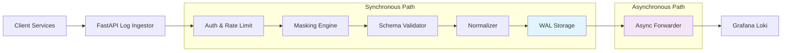
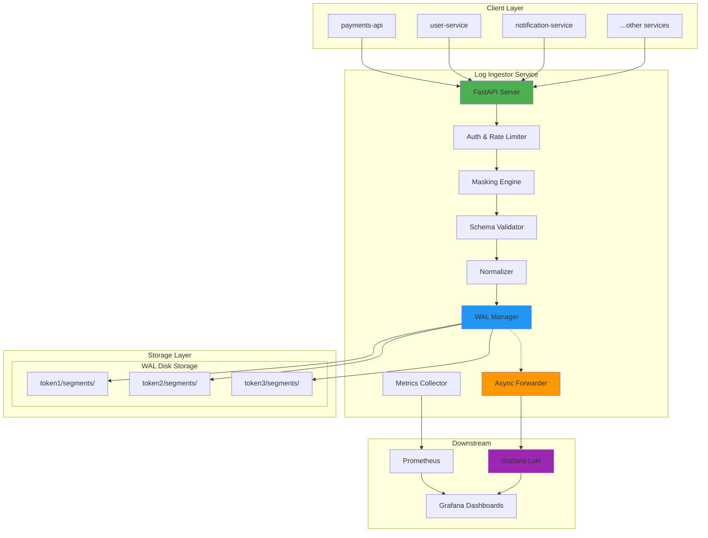
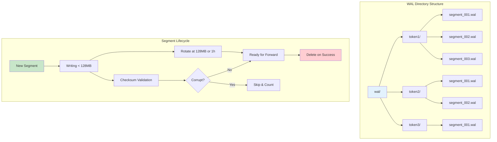
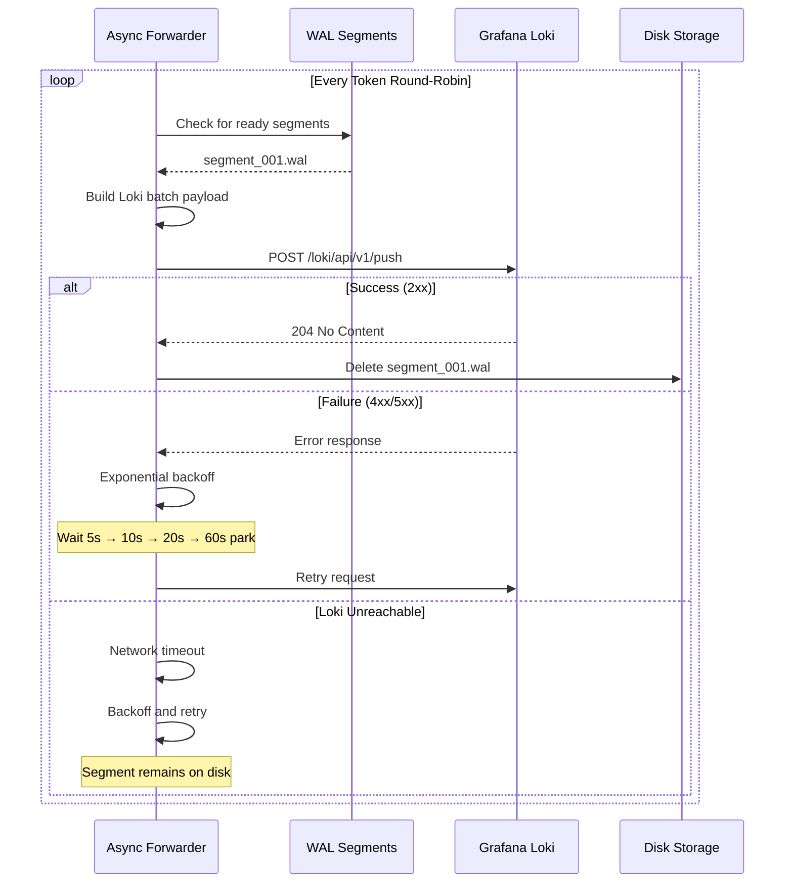
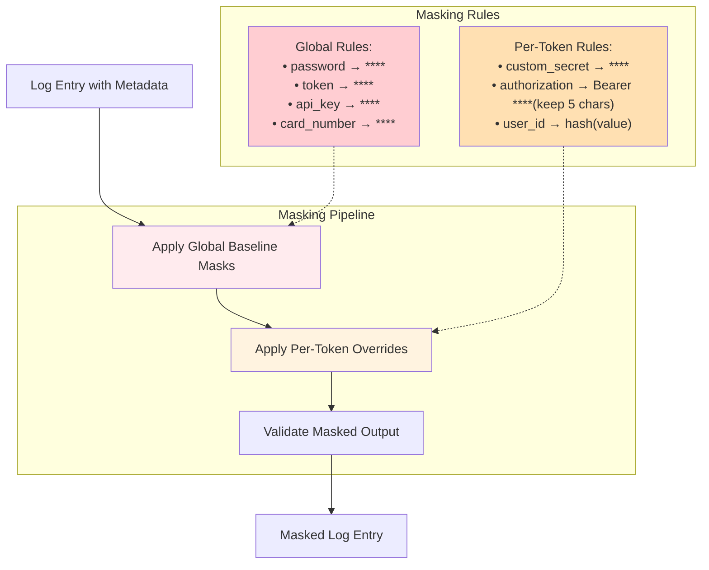
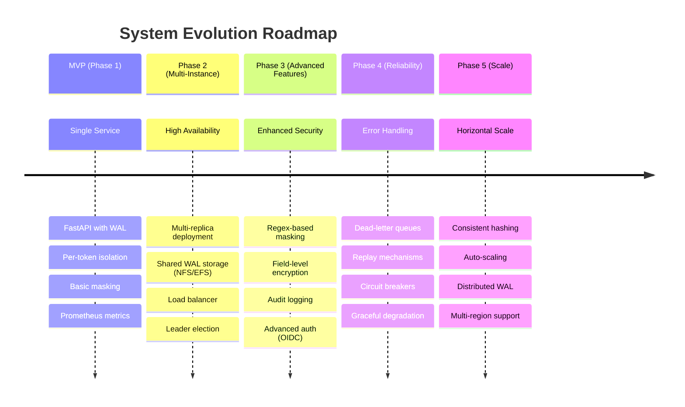

# ADR-001: Log Ingestor System Architecture

**Date:** 2025-09-21  
**Status:** Accepted  
**Deciders:** Engineering Team  
**Technical Story:** Internal Log Ingestor → Grafana Loki MVP  

## Context

Our organization needs a centralized log ingestion service that can:

- Standardize log formats across multiple services
- Ensure data consistency and reliability
- Handle sensitive data masking
- Provide resilience during downstream outages
- Scale to handle high-throughput log ingestion

The current landscape lacks a unified approach to log collection, leading to inconsistent schemas, potential data leaks, and poor observability during system failures.

## Decision

We will implement a **FastAPI-based log ingestor service** with the following architectural components:

### 1. Core Architecture Pattern: **Event-Driven Pipeline with WAL**



**Key architectural decisions:**

#### A. **Single-Service, Stateless Design**

- **Decision**: Deploy as a single FastAPI service without external databases
- **Rationale**: Simplifies MVP deployment, reduces operational complexity, eliminates database as a failure point
- **Trade-off**: Limits horizontal scaling in MVP but meets throughput requirements (1,000+ entries/s)

#### B. **Write-Ahead Log (WAL) for Durability**

- **Decision**: Implement per-token disk-based WAL queues for buffering
- **Rationale**: Provides durability guarantees during Loki outages, enables per-tenant isolation
- **Trade-off**: Requires disk management but eliminates data loss during short outages

#### C. **Application-Level Security**

- **Decision**: Handle authentication and rate limiting within the FastAPI application
- **Rationale**: Provides fine-grained per-token controls, simplifies deployment without external auth services
- **Trade-off**: Couples security with application logic but reduces external dependencies

#### D. **Synchronous Ingestion, Asynchronous Forwarding**

- **Decision**: Accept logs synchronously (202 response after WAL write), forward to Loki asynchronously
- **Rationale**: Provides immediate acknowledgment to clients while ensuring durability
- **Trade-off**: Introduces complexity but improves client experience and system resilience

## Architecture Components

### System Overview Diagram



### 1. **API Layer**

- **Technology**: FastAPI with Pydantic validation
- **Endpoints**: `/v1/logs:ingest`, `/metrics`, `/healthz`, `/readyz`
- **Authentication**: Bearer token validation
- **Rate Limiting**: Token-bucket algorithm per token

### 2. **Processing Pipeline**

```python
# Conceptual flow
async def process_logs(request):
    await authenticate_and_rate_limit(request.token)
    masked_entries = await mask_sensitive_data(request.entries, request.token)
    validated_entries = await validate_schema(masked_entries)
    normalized_entries = await normalize_for_loki(validated_entries)
    await wal.append(request.token, normalized_entries)
    return 202  # Acknowledged
```

### 3. **WAL (Write-Ahead Log) System**



- **Structure**: Per-token directories (`wal/<token>/`)
- **Segments**: 128MB max or 1-hour age rotation
- **Quotas**: 2GB or 24-hour retention per token
- **Integrity**: Checksummed segments with corruption detection

### 4. **Async Forwarder**



- **Pattern**: Round-robin per token with exponential backoff
- **Batching**: Optimized Loki push payloads
- **Retry Logic**: [5s, 10s, 20s] backoff with 60s park time
- **Cleanup**: Delete segments on successful Loki acknowledgment

### 5. **Data Masking Engine**



- **Global Baseline**: Always mask `password`, `token`, `authorization`, `api_key`, `secret`, `card_number`
- **Per-Token Overrides**: Additional masking rules per client
- **Execution Point**: Before WAL persistence (never store unmasked sensitive data)

## Alternatives Considered

### Alternative 1: **Message Queue Architecture (Kafka/RabbitMQ)**

- **Pros**: Battle-tested, horizontal scaling, built-in durability
- **Cons**: Additional infrastructure, operational complexity, over-engineering for MVP
- **Decision**: Rejected for MVP due to complexity vs. benefit ratio

### Alternative 2: **Database-Backed Queue**

- **Pros**: ACID guarantees, familiar operations
- **Cons**: Database becomes SPOF, additional infrastructure, potential bottleneck
- **Decision**: Rejected in favor of file-based WAL for simplicity

### Alternative 3: **Direct Loki Push (No WAL)**

- **Pros**: Simplest implementation, lowest latency
- **Cons**: Data loss during Loki outages, no durability guarantees
- **Decision**: Rejected due to durability requirements

### Alternative 4: **Microservices Architecture**

- **Pros**: Service separation, independent scaling
- **Cons**: Network complexity, service discovery, over-engineering for MVP
- **Decision**: Rejected for MVP; can evolve later

## Consequences

### Positive

- **Durability**: Zero data loss during short Loki outages (≤10 minutes within quota)
- **Isolation**: Per-token WAL queues prevent one client from affecting others
- **Security**: Sensitive data masked before persistence, never stored in plain text
- **Observability**: Rich Prometheus metrics and health checks
- **Simplicity**: Single service deployment, no external dependencies beyond Loki

### Negative

- **Disk Management**: Requires monitoring disk usage and WAL cleanup
- **Limited Horizontal Scaling**: Single-instance architecture for MVP
- **Memory Usage**: In-memory rate limiting and token management
- **Operational Complexity**: WAL maintenance and monitoring required

### Neutral

- **Schema Rigidity**: Strict validation may require client updates but ensures consistency
- **Async Forwarding**: Slight delay in log visibility but improved reliability

## Implementation Considerations

### Technology Stack

- **Runtime**: Python 3.11+ with FastAPI
- **Validation**: Pydantic models for schema enforcement
- **Metrics**: Prometheus client library
- **Async Processing**: asyncio with background tasks
- **File I/O**: aiofiles for async WAL operations

### Deployment Requirements

- **Resources**: 2+ CPU cores, 4GB+ RAM, 50GB+ disk for WAL
- **Monitoring**: Disk usage, WAL depth, Loki connectivity
- **Configuration**: Hot-reload capability for masking rules and quotas

### Future Evolution Path



1. **Phase 2**: Multi-replica deployment with shared storage
2. **Phase 3**: Advanced masking (regex-based, field-level)
3. **Phase 4**: Dead-letter queues and replay mechanisms
4. **Phase 5**: Horizontal scaling with consistent hashing

## Acceptance Criteria Validation

This architecture supports all defined acceptance criteria:

- ✅ Invalid requests rejected with 400; valid with 202
- ✅ Token validation and rate limits enforced in-app
- ✅ Masking confirmed before WAL persistence
- ✅ Per-token WAL isolation prevents cross-tenant impact
- ✅ Zero data loss during ≤10 minute Loki outages (within quota)
- ✅ `/readyz` reflects Loki connectivity and disk health

## References

- [PRD: Internal Log Ingestor → Grafana Loki MVP](./log_ingestor_→_loki_mvp_prd_v_0.md)
- [Grafana Loki API Documentation](https://grafana.com/docs/loki/latest/api/)
- [FastAPI Documentation](https://fastapi.tiangolo.com/)
- [Prometheus Metrics Guidelines](https://prometheus.io/docs/practices/naming/)

---

**Next Steps:**

1. Set up FastAPI project structure
2. Implement core data models and validation
3. Build WAL system with per-token isolation
4. Develop async forwarder with retry logic
5. Add comprehensive monitoring and health checks
