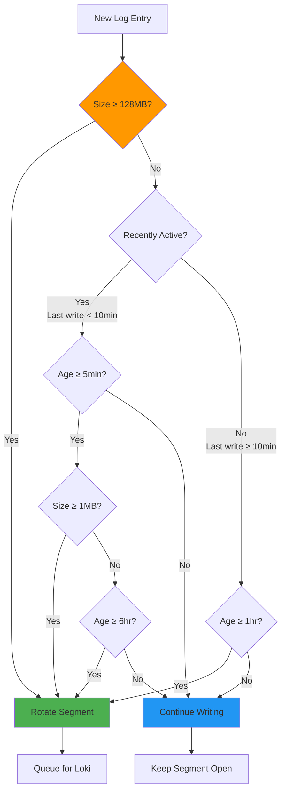

# ADR-002: WAL Segment Rotation Strategy

**Date:** 2025-09-21  
**Status:** Accepted  
**Deciders:** Engineering Team  
**Technical Story:** Optimize WAL segment rotation for fast log visibility and efficient storage  
**Supersedes:** N/A  
**Related:** [ADR-001: Log Ingestor System Architecture](./ADR-001-log-ingestor-system-architecture.md)

## Context

The Write-Ahead Log (WAL) system requires a segment rotation policy that determines when to close current segments and make them available for forwarding to Loki. This decision directly impacts:

1. **Log visibility latency** - How quickly logs appear in Loki for debugging/monitoring
2. **Storage efficiency** - Avoiding file system pollution with many small files
3. **System performance** - Balancing I/O operations and memory usage
4. **Operational complexity** - Managing different service traffic patterns

### Current Challenge

We initially considered a simple dual-condition rotation policy:

- Size-based: Rotate at 128MB
- Time-based: Rotate after 1 hour

However, this creates conflicting requirements:

- **Fast debugging needs**: Logs should appear in Loki within minutes for active debugging
- **Storage efficiency**: Low-traffic services shouldn't create hourly 1MB files
- **Operational simplicity**: The policy should be predictable and configurable

## Decision

We will implement a **hybrid adaptive rotation strategy** with both automatic intelligent rotation and manual flush capabilities.

### Core Strategy: **Adaptive Time-Based Rotation**



### Configuration Parameters

```yaml
wal:
  # Hard limits
  segment_max_bytes: 134217728           # 128MB - absolute size limit
  
  # Adaptive rotation timings
  rotation_time_active_minutes: 5        # Rotate active segments every 5 min
  rotation_time_idle_hours: 1            # Rotate idle segments every 1 hour
  idle_threshold_minutes: 10             # Consider idle after 10 min no writes
  
  # Minimum thresholds
  min_rotation_bytes: 65536              # 64KB - minimum size for time-based rotation
  force_rotation_hours: 6                # Force rotate after 6 hours regardless
  
  # Manual controls
  flush_endpoint_enabled: true           # Enable manual flush API
```

### Manual Flush Capability

Add an administrative endpoint for immediate segment rotation:

```http
POST /v1/admin/flush
Authorization: Bearer <admin-token>
Content-Type: application/json

{
  "token": "service-token-123",  // Optional: specific token
  "force": true                  // Optional: ignore minimum size
}
```

**Response:**

```json
{
  "flushed_segments": [
    {
      "token": "service-token-123",
      "segment": "segment_003.wal",
      "size_bytes": 2048576,
      "entries_count": 1247
    }
  ],
  "message": "Segments flushed and queued for forwarding"
}
```

## Implementation Logic

### Core Rotation Decision Algorithm

```pseudocode
FUNCTION should_rotate_segment(segment):
    // Hard size limit - always rotate if too big
    IF segment.size_bytes >= MAX_SEGMENT_SIZE (128MB) THEN
        RETURN true
    END IF
    
    // Don't rotate tiny segments unless they're very old
    IF segment.size_bytes < MIN_ROTATION_SIZE (64KB) AND 
       segment.age_seconds < FORCE_ROTATION_TIME (6 hours) THEN
        RETURN false
    END IF
    
    // Determine if segment is actively receiving logs
    seconds_since_last_write = current_time - segment.last_write_time
    is_active = seconds_since_last_write < IDLE_THRESHOLD (10 minutes)
    
    IF is_active THEN
        // Active segment: rotate frequently if minimum size reached
        RETURN segment.age_seconds >= ACTIVE_ROTATION_TIME (5 minutes) AND
               segment.size_bytes >= MIN_ROTATION_SIZE (64KB)
    ELSE
        // Idle segment: rotate less frequently
        RETURN segment.age_seconds >= IDLE_ROTATION_TIME (1 hour)
    END IF
END FUNCTION
```

### Manual Flush Logic

```pseudocode
FUNCTION manual_flush(target_token, force_flag):
    segments_to_flush = []
    
    IF target_token is specified THEN
        segment = get_active_segment_for_token(target_token)
        IF segment exists AND (force_flag OR segment.size_bytes >= MIN_ROTATION_SIZE) THEN
            ADD segment to segments_to_flush
        END IF
    ELSE
        // Flush all tokens
        FOR EACH active_segment IN get_all_active_segments() DO
            IF force_flag OR active_segment.size_bytes >= MIN_ROTATION_SIZE THEN
                ADD active_segment to segments_to_flush
            END IF
        END FOR
    END IF
    
    FOR EACH segment IN segments_to_flush DO
        rotate_segment(segment)
        queue_for_forwarding(segment)
    END FOR
    
    RETURN segments_to_flush
END FUNCTION
```

### Configuration Constants

```pseudocode
CONSTANTS:
    MAX_SEGMENT_SIZE = 128 * 1024 * 1024     // 128MB
    MIN_ROTATION_SIZE = 64 * 1024            // 64KB
    ACTIVE_ROTATION_TIME = 5 * 60            // 5 minutes
    IDLE_ROTATION_TIME = 60 * 60             // 1 hour
    IDLE_THRESHOLD = 10 * 60                 // 10 minutes
    FORCE_ROTATION_TIME = 6 * 60 * 60        // 6 hours
```

## Alternatives Considered

### Alternative 1: **Simple Time-Based Rotation (Original)**

- **Approach**: Rotate every 1 hour regardless of size
- **Pros**: Simple, predictable
- **Cons**: Creates many small files, storage inefficient
- **Decision**: Rejected due to file system pollution

### Alternative 2: **Size-Only Rotation**

- **Approach**: Only rotate when segments reach 128MB
- **Pros**: Efficient storage, fewer files
- **Cons**: Poor debugging experience, logs could be delayed for hours
- **Decision**: Rejected due to debugging requirements

### Alternative 3: **Fixed Short Intervals**

- **Approach**: Rotate every 5 minutes for all services
- **Pros**: Fast log visibility
- **Cons**: Excessive file creation for idle services
- **Decision**: Rejected due to operational overhead

### Alternative 4: **Manual-Only Rotation**

- **Approach**: Only rotate on manual flush or size limit
- **Pros**: Complete control, no unnecessary files
- **Cons**: Requires manual intervention, poor for production monitoring
- **Decision**: Rejected as primary strategy, included as supplementary feature

## Consequences

### Positive

- **Fast debugging**: Active services get 5-minute log visibility
- **Storage efficient**: Idle services don't create excessive small files
- **Flexible**: Manual flush for immediate debugging needs
- **Adaptive**: Automatically adjusts to service traffic patterns
- **Configurable**: All thresholds can be tuned per environment

### Negative

- **Complexity**: More complex rotation logic to implement and test
- **Configuration overhead**: More parameters to tune and monitor
- **Edge cases**: Need to handle various timing edge cases
- **Admin endpoint**: Additional security considerations for manual flush

### Neutral

- **Monitoring**: Requires metrics on rotation patterns and segment sizes
- **Documentation**: Need clear guidelines on when to use manual flush
- **Testing**: Multiple scenarios to validate (active/idle/mixed patterns)

## Monitoring and Metrics

Key metrics to track rotation effectiveness:

```python
# Prometheus metrics
segment_rotations_total{reason="size|time_active|time_idle|manual", token="..."}
segment_size_bytes_histogram{token="..."}
segment_age_seconds_histogram{reason="...", token="..."}
manual_flush_requests_total{token="...", force="true|false"}
small_segment_rotations_total{token="..."}  # size < 1MB
```

## Migration Strategy

1. **Phase 1**: Implement adaptive rotation with conservative defaults
2. **Phase 2**: Add manual flush endpoint with admin authentication
3. **Phase 3**: Monitor patterns and tune thresholds based on real usage
4. **Phase 4**: Consider per-token rotation configuration if needed

## Acceptance Criteria

- ✅ Active services (writes in last 10min) rotate segments every 5 minutes if ≥64KB
- ✅ Idle services rotate segments every 1 hour regardless of size
- ✅ No segment exceeds 128MB
- ✅ Manual flush endpoint works for immediate debugging
- ✅ Segments smaller than 64KB don't rotate unless idle for 1+ hours
- ✅ Force rotation after 6 hours prevents indefinite delays
- ✅ Configuration is hot-reloadable
- ✅ Metrics provide visibility into rotation patterns

## References

- [ADR-001: Log Ingestor System Architecture](./ADR-001-log-ingestor-system-architecture.md)
- [PRD: Internal Log Ingestor → Grafana Loki MVP](../log_ingestor_→_loki_mvp_prd_v_0.md)
- [Grafana Loki Best Practices](https://grafana.com/docs/loki/latest/best-practices/)

---

**Next Steps:**

1. Implement adaptive rotation logic with configuration
2. Add manual flush endpoint with proper authentication
3. Create comprehensive test cases for all rotation scenarios
4. Set up monitoring dashboards for rotation metrics
5. Document operational procedures for manual flush usage
