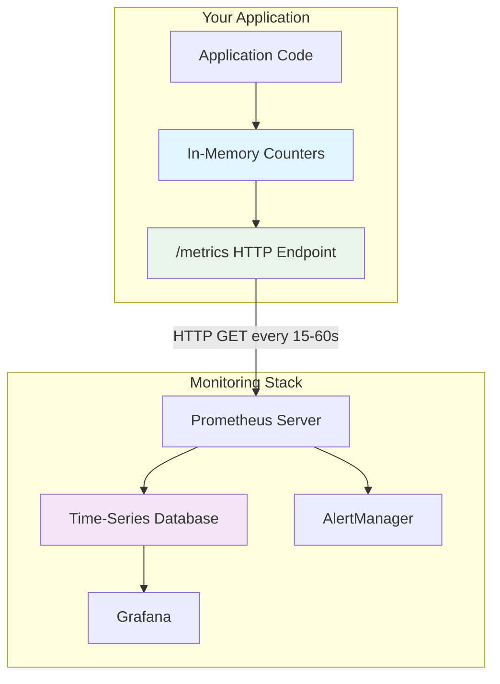
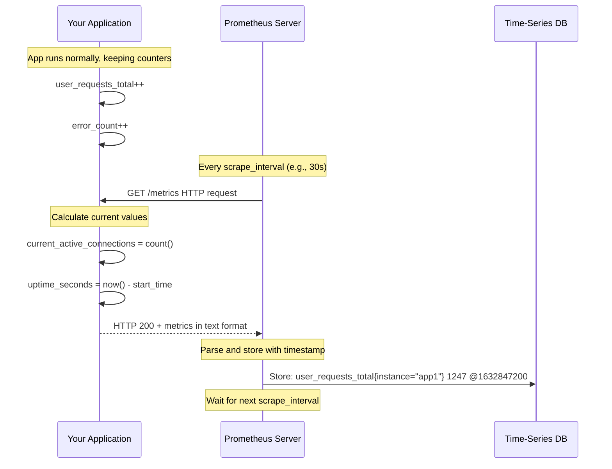

# Prometheus Metrics in Stateless Services: A Complete Guide

**Purpose:** Educational reference for understanding how Prometheus works with stateless applications  
**Audience:** Developers new to Prometheus or time-series monitoring  
**Last Updated:** 2025-09-21

---

## Table of Contents

1. [How Prometheus Works](#how-prometheus-works)
2. [The Pull-Based Model](#the-pull-based-model)
3. [Metrics in Stateless Services](#metrics-in-stateless-services)
4. [Implementation Examples](#implementation-examples)
5. [Metric Types Explained](#metric-types-explained)
6. [Best Practices](#best-practices)
7. [Common Misconceptions](#common-misconceptions)

---

## How Prometheus Works

### The Big Picture



### Key Concepts

**Prometheus is NOT a logging system** - it's a **time-series metrics system**:

- **Logs**: "User <john@example.com> logged in at 14:32:15"
- **Metrics**: "login_attempts_total = 1,247" (measured over time)

**Pull-based architecture** means:

- Your app doesn't send data to Prometheus
- Prometheus comes to your app and asks for current metrics
- Your app calculates metrics on-demand when asked

---

## The Pull-Based Model

### How Scraping Works



### Prometheus Configuration Example

```yaml
# prometheus.yml
global:
  scrape_interval: 30s  # How often to scrape targets

scrape_configs:
  - job_name: 'log-ingestor'
    static_configs:
      - targets: ['log-ingestor:8080']  # Your service
    metrics_path: '/metrics'            # Your metrics endpoint
    scrape_interval: 15s                # Override global interval
```

---

## Metrics in Stateless Services

### What "Stateless" Means for Metrics

**Stateless Service:**

- No persistent storage for business data
- Can be restarted, scaled, or moved without losing critical state
- Each instance handles requests independently

**But metrics can be "stateful" in memory:**

```pseudocode
// These live in memory only - lost on restart
global_counters = {
    requests_total: 0,
    errors_total: 0,
    current_connections: 0
}

// When handling requests
function handle_request():
    global_counters.requests_total++
    
    if request_fails:
        global_counters.errors_total++
```

### Why This Works Perfectly

1. **Historical data preserved**: Prometheus already scraped and stored past metrics
2. **Current state available**: Service calculates current metrics on-demand
3. **Restart resilience**: Lost counters don't affect historical analysis
4. **Scaling friendly**: Each instance exposes its own metrics

### Example: Service Restart Impact

```mermaid
timeline
    title Metrics During Service Restart
    
    section Running (10:00-10:30)
        Prometheus scrapes : requests_total: 0→500→1000→1500
                          : errors_total: 0→2→5→8
    
    section Restart (10:30)
        Service restarts : All counters reset to 0
                        : Prometheus keeps historical data
    
    section Running Again (10:30-11:00)
        Prometheus scrapes : requests_total: 0→300→600→900
                          : errors_total: 0→1→3→4
    
    section Analysis
        Total requests : Historical: 1500 + Current: 900 = 2400
                      : Prometheus can calculate rates across restart
```

---

## Implementation Examples

### Basic Counter Implementation

```pseudocode
// Global state in your application
metrics = {
    http_requests_total: 0,
    http_request_duration_seconds: [],
    active_connections: 0,
    last_request_time: null
}

// Business logic updates metrics
function handle_http_request(request):
    start_time = now()
    metrics.http_requests_total++
    metrics.active_connections++
    
    try:
        response = process_request(request)
        metrics.last_request_time = now()
        return response
    finally:
        duration = now() - start_time
        metrics.http_request_duration_seconds.append(duration)
        metrics.active_connections--

// Metrics endpoint (called by Prometheus)
function get_metrics():
    uptime = now() - application_start_time
    avg_duration = average(metrics.http_request_duration_seconds)
    
    return format_prometheus_metrics({
        "http_requests_total": metrics.http_requests_total,
        "http_request_duration_seconds_avg": avg_duration,
        "active_connections": metrics.active_connections,
        "uptime_seconds": uptime
    })
```

### Log Ingestor Specific Example

```pseudocode
// Metrics for our log ingestor service
log_ingestor_metrics = {
    // Counters (always increase)
    logs_ingested_total: {},              // by token
    logs_rejected_total: {},              // by reason, token
    wal_segments_created_total: {},       // by token
    wal_segments_forwarded_total: {},     // by token
    masking_operations_total: {},         // by field, token
    
    // Gauges (current state)
    wal_segments_active: {},              // by token
    wal_disk_usage_bytes: {},             // by token
    current_connections: 0,
    
    // Histograms (distributions)
    request_duration_seconds: [],
    wal_segment_size_bytes: [],
    batch_size_entries: []
}

// Update metrics during operation
function ingest_logs(token, log_batch):
    start_time = now()
    
    try:
        // Validate and process
        valid_logs = validate(log_batch)
        masked_logs = mask_sensitive_data(valid_logs, token)
        
        // Update metrics
        log_ingestor_metrics.logs_ingested_total[token] += valid_logs.length
        log_ingestor_metrics.masking_operations_total[token] += count_masked_fields(masked_logs)
        log_ingestor_metrics.batch_size_entries.append(log_batch.length)
        
        // Write to WAL
        wal_write(token, masked_logs)
        
    catch validation_error:
        log_ingestor_metrics.logs_rejected_total[token] += log_batch.length
        
    finally:
        duration = now() - start_time
        log_ingestor_metrics.request_duration_seconds.append(duration)

// Metrics endpoint response
GET /metrics:
    return """
    # HELP logs_ingested_total Total number of log entries successfully ingested
    # TYPE logs_ingested_total counter
    logs_ingested_total{token="payments-api"} 12847
    logs_ingested_total{token="user-service"} 8392
    
    # HELP logs_rejected_total Total number of log entries rejected
    # TYPE logs_rejected_total counter
    logs_rejected_total{token="payments-api",reason="validation"} 23
    logs_rejected_total{token="user-service",reason="rate_limit"} 5
    
    # HELP wal_segments_active Current number of active WAL segments
    # TYPE wal_segments_active gauge
    wal_segments_active{token="payments-api"} 3
    wal_segments_active{token="user-service"} 1
    
    # HELP request_duration_seconds HTTP request duration
    # TYPE request_duration_seconds histogram
    request_duration_seconds_bucket{le="0.1"} 8932
    request_duration_seconds_bucket{le="0.5"} 12847
    request_duration_seconds_bucket{le="1.0"} 12850
    request_duration_seconds_bucket{le="+Inf"} 12851
    request_duration_seconds_sum 1247.3
    request_duration_seconds_count 12851
    """
```

---

## Metric Types Explained

### 1. Counter

**What it is:** A number that only goes up (resets to 0 on restart)

**Use for:** Counting events - requests, errors, messages processed

```pseudocode
// Examples
http_requests_total = 1247        // Total HTTP requests since startup
errors_total = 23                 // Total errors since startup
logs_processed_total = 892847     // Total logs processed since startup
```

**In Grafana:** Use `rate()` function to see requests per second

```promql
rate(http_requests_total[5m])  # Requests per second over last 5 minutes
```

### 2. Gauge

**What it is:** A number that can go up and down

**Use for:** Current state - active connections, memory usage, queue depth

```pseudocode
// Examples
active_connections = 42           // Current active connections
memory_usage_bytes = 1073741824  // Current memory usage
queue_depth = 156                 // Current items in queue
```

**In Grafana:** Display directly or use for alerting

```promql
memory_usage_bytes > 8000000000  # Alert if memory > 8GB
```

### 3. Histogram

**What it is:** Tracks distribution of values in buckets

**Use for:** Request durations, response sizes, batch sizes

```pseudocode
// Example: Request duration tracking
request_duration_seconds_bucket{le="0.1"} = 8932   // 8932 requests ≤ 100ms
request_duration_seconds_bucket{le="0.5"} = 12847  // 12847 requests ≤ 500ms
request_duration_seconds_bucket{le="1.0"} = 12850  // 12850 requests ≤ 1s
request_duration_seconds_sum = 1247.3              // Total time of all requests
request_duration_seconds_count = 12851             // Total number of requests
```

**In Grafana:** Calculate percentiles

```promql
histogram_quantile(0.95, rate(request_duration_seconds_bucket[5m]))  # 95th percentile
```

### 4. Summary

**What it is:** Like histogram but calculates percentiles on the client side

**Use for:** Similar to histogram, but less flexible for aggregation

---

## Best Practices

### Naming Conventions

```pseudocode
// Good metric names
http_requests_total              // Clear, includes unit, uses total suffix
request_duration_seconds         // Includes unit (seconds)
memory_usage_bytes              // Includes unit (bytes)
active_connections              // Clear what it measures

// Bad metric names
requests                        // Missing unit, unclear
time                           // Too vague
data                          // Meaningless
```

### Label Usage

```pseudocode
// Good labels
http_requests_total{method="GET", status="200", endpoint="/api/logs"}
wal_segments_active{token="payments-api", status="ready"}

// Bad labels (high cardinality)
http_requests_total{user_id="12345", session="abc123"}  // Too many unique values
logs_ingested{log_content="User logged in"}             // Unbounded values
```

### Performance Considerations

```pseudocode
// Efficient: Pre-aggregate in memory
function update_request_metrics(method, status_code):
    key = method + "_" + status_code
    request_counts[key]++

// Inefficient: Calculate on every scrape
function get_request_count():
    count = 0
    for request in all_historical_requests:  // Don't do this!
        count++
    return count
```

### Memory Management

```pseudocode
// Good: Bounded collections
max_duration_samples = 10000
if request_durations.length > max_duration_samples:
    request_durations = request_durations.slice(-max_duration_samples)

// Bad: Unbounded growth
request_durations.append(duration)  // Will eventually crash
```

---

## Common Misconceptions

### ❌ "I need a database to store metrics"

**Reality:** Your app keeps simple counters in memory, Prometheus stores the time-series data

### ❌ "Metrics are lost when the service restarts"

**Reality:** Current counters reset, but Prometheus has all historical data

### ❌ "I need to send metrics to Prometheus"

**Reality:** Prometheus pulls metrics from your `/metrics` endpoint

### ❌ "Stateless services can't have metrics"

**Reality:** Perfect match! Stateless services with in-memory metrics work great

### ❌ "I need complex metric calculations"

**Reality:** Keep it simple - counters, gauges, basic histograms. Prometheus does the math

### ❌ "High cardinality labels are fine"

**Reality:** Avoid labels with many unique values (user IDs, timestamps, etc.)

---

## Practical Checklist

### For Your Log Ingestor Service

**✅ Implement these metrics:**

- `logs_ingested_total{token}` - Counter
- `logs_rejected_total{token, reason}` - Counter  
- `wal_segments_active{token}` - Gauge
- `request_duration_seconds` - Histogram
- `wal_disk_usage_bytes{token}` - Gauge

**✅ Expose via HTTP endpoint:**

- `GET /metrics` returns Prometheus format
- Content-Type: `text/plain`
- Include help text and type declarations

**✅ Keep it simple:**

- In-memory counters only
- Reset to 0 on startup (that's fine!)
- Let Prometheus handle storage and queries

**✅ Monitor what matters:**

- Throughput (logs per second)
- Error rates (rejections per second)  
- Latency (request duration percentiles)
- Resource usage (disk, memory)

---

## Example Grafana Queries

```promql
# Logs ingested per second by token
rate(logs_ingested_total[5m])

# Error rate percentage
rate(logs_rejected_total[5m]) / rate(logs_ingested_total[5m]) * 100

# 95th percentile request duration
histogram_quantile(0.95, rate(request_duration_seconds_bucket[5m]))

# WAL disk usage by token
wal_disk_usage_bytes

# Active segments across all tokens
sum(wal_segments_active)
```

---

**Key Takeaway:** Prometheus + stateless services = perfect match! Keep metrics simple, let Prometheus do the heavy lifting, and focus on measuring what matters for your system's health and performance.
